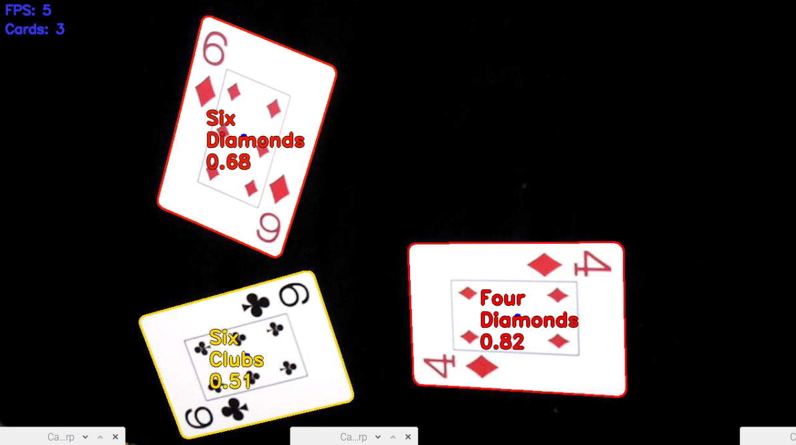

# card-detector

Simple system for real-time playing card detection, written in Python

### Usage

`python3 CardDetector.py`

### Used modules

- OpenCV
- NumPy
- PiCamera - *(basicaly works with any other module but some reimplementations in `Camera.py` are needed)*

### Tested on:

- Raspberry Pi 3B+ with PiCamera
- Raspbian

### Simplified working algorithm

```python
for frame in stram:
    cards = detect_all_cards_present()
    for card in cards:
        rank_part, suite_part = zoom_card(card)
        rank_diff, rank = match_rank(rank_part)
        suite_diff, suite = match_suite(suite_part)
        if rank_diff < RANK_THRESH and suite_diff < SUITE_THRESH:
            make_an_overlay_on_card(card=card, rank=rank, suite=suite)
```

### Docs

Full documentation, with further explaination is available under `./docs/latex/raport.pdf`

### Some results

#### with one card


#### with two cards


#### with three cards



#### with even more cards

