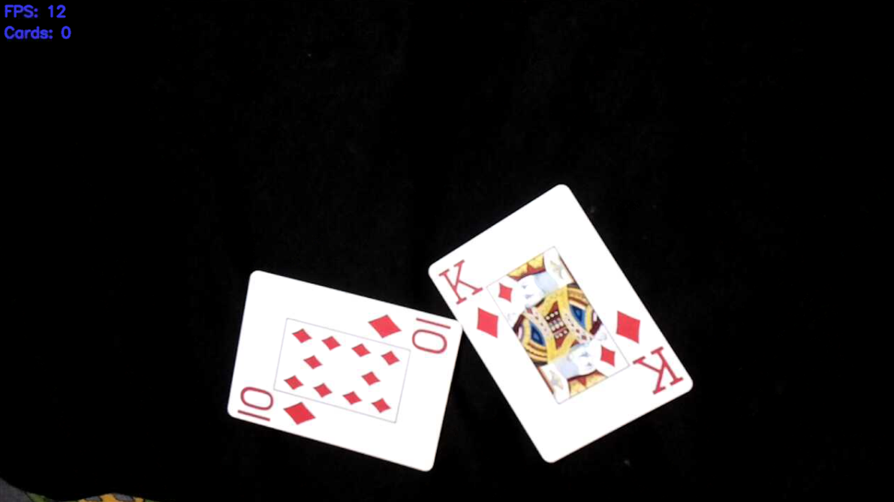
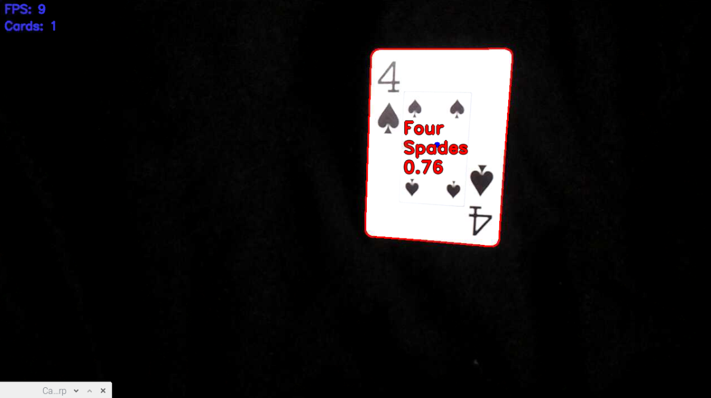
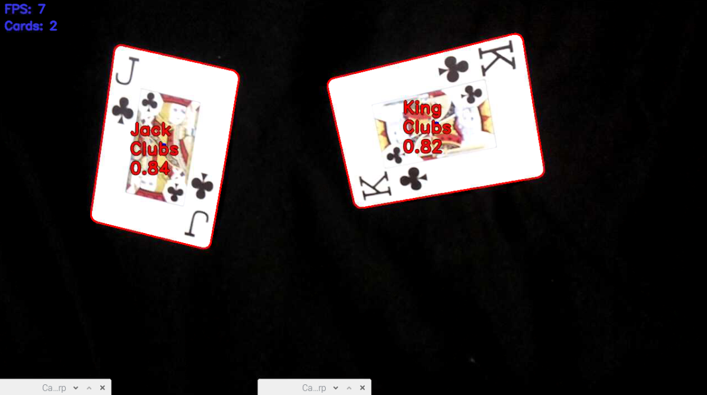
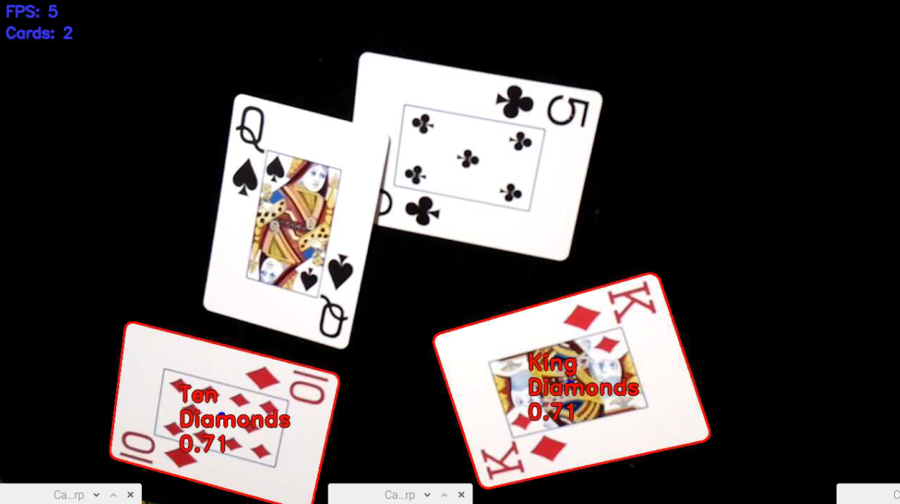

# Detektor Kart

## Problem

Klasyfikacja kart z obrazu strumieniowanego. Rozwiązanie powinno w czasie rzeczywistym określać kolor i wartość zaprezentowanych kart. Dodatkowo algorytm powinien rozpoznawać dowolną ilość znajdujących się na ekranie / strumieniu kart.

## Rozwiązanie

Proponowany algorytm porównuje aktualnie odnalezioną wartość i kolor, dla każdej znalezionej na obrazie karty, z wartością z bazy posiadanych kolorów i wartości. W bazie przechowywane są odpowiednio przygotowane zdjęcia cech kart. Obraz, który zostanie najlepiej dopasowany - będzie posiadał najmniej niedopasowanych pixeli i przekroczy pewną wartość progową zostanie uznany za poprawny a karta rozpoznana.

### Narzędzia

- Python 3.6.8
- OpenCV 2
- NumPy
  
### Środowisko uruchomieniowe

- **OS**: Linux - Debian Wheezy
- **Platforma**: RaspberryPi 3B
- **Kamera**: PiCamera - lub substytut działający z modułem PiCamera

### Skrócony algorytm działania

```python
for frame in stram:
    cards = detect_all_cards_present()
    for card in cards:
        rank_part, suite_part = zoom_card(card)
        rank_diff, rank = match_rank(rank_part)
        suite_diff, suite = match_suite(suite_part)
        if rank_diff < RANK_THRESH and suite_diff < SUITE_THRESH:
            make_an_overlay_on_card(card=card, rank=rank, suite=suite)
```

### Kroki działania algorytmu

#### 1. Pobranie obrazu z kamery

Całkowite wymiary pobieranego obrazu to 1280x720 pixeli. Jest to spowodowane dobrą proporcją mocy obliczeniowej potrzebnej do analizy takiego obrazu a samą jakością obrazu.



#### 2. Wydzielenie kart z obrazu

Wydzielanie poszczególnych kart odbywa się na zasadzie wyszarzania, rozmazywanie i thresholdingu obrazu pobranego w poprzednim kroku. Wartość porogowa podczas thresholdingu jest ustalana dynamicznie na podstawie środkowego piksela w najwyższym rzędzie obrazu. Następnie za pomocą funkcji wbudowanych w bibliotekę OpenCV wyznaczany jest obwód poszczególnych kart. Każdy wykryty obwód jest sprawdzany pod kątem ilości posiadanych narożników (conajmniej 4) i zajmowanego pola. Pozytywne przejście testów sprawia, że analizowany obwód jest akceptowany jako karta.


#### 3. Wydzielenie koloru i wartości karty

Ze względu na właściwość kart do gry jaką jest stałe miejsce występowania wartości i koloru niezależnie od orientacji karty - góra, dół - operacja wydzielania cech karty jest łatwa. Wystarczy tylko wyciąć z obrazu karty jej odpowiedni kawałek, tj. lewy górny narożnik. Następnie należy porównać go z bazą dostępnych kolorów i wartości.


#### 4. Nałożenie rezultatów klasyfikacji na obraz wyjściowy

Jest to tylko jeden z proponowanych sposobów prezentacji wyników, w którym nazwy rozpoznanych kart są nakładane na same karty, a informacja jest uzupełniana o stopień pewności. Dodatkowo informacje są kodowane kolorami na podstawie stopnia pewności.

## Wyniki działania algorytmu

### Jedna karta

W przypadku pojedynczych kart prezentowany algorytm działa z blisko 100% skutecznością, rozpoznając karty we wszystkich prezentowanych przypadkach




### Dwie karty

Tak jak w przypadku pojednyczych kart algorytm radzi sobie bardzo dobrze. Problematyczne natomiast są sytuacje, w których karty nachodzą na siebie.




### Trzy i więcej kart

Tak jak w przypadku dwóch kart algorytm wykazuje wysoką efektywność, o ile karty nie nachodzą na siebie.




## Podsumowanie

### Komentarz do wyników

Na podstawie wyżej zaprezentowanych wyników, stwierdzam, że algorytm cechuje się wysoką efektywnością w rozpoznawaniu kart. W szczególności efektywności tej nie zmniejszają zmieniające się warunki świetlne o ile nie tworzą silnych refleksów powodujących efekt olśnienia kamery. Dodatkowo na wyniki nie ma wpływu ułożenie i orientacja kart a także ich ilość.

Znaczący wpływ na jakość klasyfikacji ma nakładanie się kart na siebie. W takich przypadkach nie jest możliwe szybkie poprawne rozpoznanie kart. Jest to spowodowane błędnym wykrywaniem obwodu kart znajdujących się na stole, a co za tym idzie obydwie karty są wykrywane jako jedna. Sprawia to, że algorytm wydzielający karty z obrazu odrzuca je, ponieważ ich łączna powierzchnia jest znacząco większa od maksymalnej akceptowalnej powierzchni karty.

### Dalszy rozwój

Elementem wymagającym dalszych prac jest moduł separacji poszczególnych kart z obrazu. W szczególności polepszenie mechanizmu pozwalającego na oddzielania nachodzących na siebie kart. Implementacja nie jest trudna z punktu matematycznego, ponieważ wystarczy określić conajmniej dwa przeciwległe narożniki a wszystkie pozostałe można przybliżyć. Problematycznym natomiast może okazać się czas potrzeby na wykonanie wszystkich obliczeń związanych z przybliżaniem brakujących narożników. Zauważmy, że algorytm dokonuje analizy obrazu w czasie rzeczywistym i niedopuszczalne jest wykonywanie obliczeń zajmujących duże ilości czasu. Jest to ważne nie tylko ze względów estetycznych - ilość klatek na sekundę - ale i ze względów praktycznych zastosowań algorytmu. Długi czas przetwarzania sprawia, że szybko poruszające się karty mogą nie być wykryte, ponieważ zdążą przelecieć przed polem widzenia kamery w czasie kiedy algorytm będzie analizował poprzednią klatkę i nie zdąży zarejestrować klatki z lecącą kartą. Jest to gółwny powód dlaczego w prezentowanym rozwiązaniu bazującym na platformie RaspberryPi nie zaimplementowano wyżej wspomnianej poprawki.
